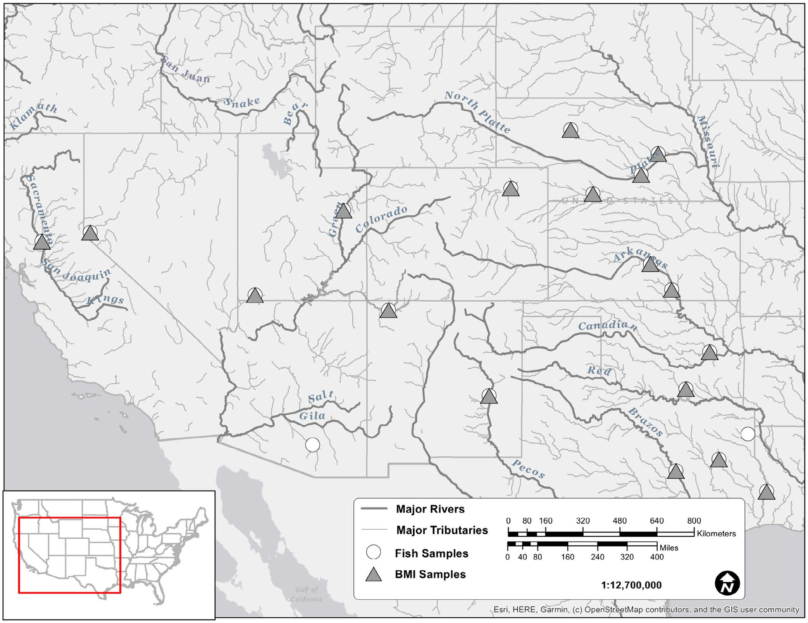

```{r setup, include=FALSE}
knitr::opts_chunk$set(echo = FALSE
                      , results = 'asis'
                      , warning = FALSE
                      , message = FALSE)
```

# Study area

This R-based tool calculates Biological Condition Gradient (BCG) model
outputs for macroinvertebrate and fish assemblages in Great Plains
streams.

{width="50%"}

------------------------------------------------------------------------

Last updated 2024-07-31
