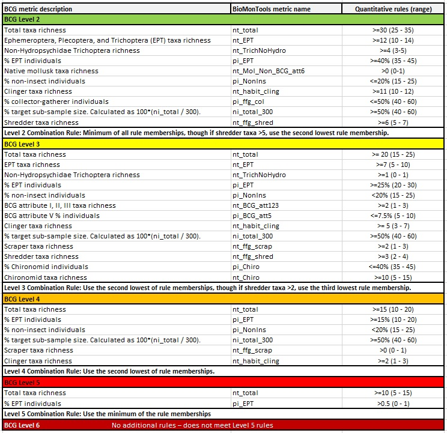
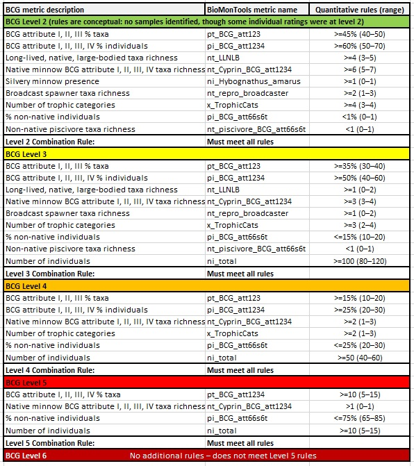

```{r setup, include=FALSE}
knitr::opts_chunk$set(echo = FALSE
                      , results = 'asis'
                      , warning = FALSE
                      , message = FALSE)
```

# Background

This website calculates Biological Condition Gradient (BCG) scores for
benthic macroinvertebrate (hereafter "bugs") and fish samples collected
from sandy bottom rivers in New Mexico (Figure 1). The USEPA has
published a practitioner's guide to BCG development that would be useful
introductory reading for someone new to the BCG framework
(<a href="https://www.epa.gov/sites/default/files/2016-02/documents/bcg-practioners-guide-report.pdf" target="_blank">USEPA
2016</a>). A concise reporting on the development of the New Mexico Bug
and Fish BCG models was published by
<a href="https://raw.githubusercontent.com/Blocktt/ShinyAppDocuments/main/NM_BCGCalc/Reports/Hughes_EtAl_2022.pdf" target="_blank">Hughes
et al. (2022)</a>. More details on iterative model development and
validation are found in the report by
<a href="https://raw.githubusercontent.com/Blocktt/ShinyAppDocuments/main/NM_BCGCalc/Reports/NMBCG_20201208_Final.docx" target="_blank">Jessup
and Bradley (2020)</a>.

Want to try running the calculator but don't have input files? Click
<a href="https://github.com/Blocktt/ShinyAppDocuments/tree/main/NM_BCGCalc/Example_Files/" target="_blank">here</a>
to download test files.

{width="50%"}

# Funding and acknowledgments

Development of NMBCGCalc and the underlying BCG model was funded by the
U.S. EPA. For more information, please contact Susan Jackson
(jackson.susank\@epa.gov).

Several individuals participated in the process of calibrating a BCG for
sandy-bottom southwestern rivers. The participants include ecological
and biological experts, authors, contributors, reviewers, and steering
committee members. The ecological and biological experts who calibrated
the BCG and developed the BCG predictive model through numerous
workshops, webinars, correspondences, and reviews included Kris Barrios,
Becky Bixby, Will Clements, Robert Cook, Joe Flotemersch, Lynette
Guevara, Anna Hamilton, Bill Harrison, Robert Hughes, Jerry Jacobi, Seva
Joseph, Boris Kondratieff, Gordon Linam, Dan McGuire, Dave Peck, John
Pfeiffer, Anne Rogers Harrison, Gary Schiffmiller, Shann Stringer, and
Meredith Zeigler. Among the experts were also several contributors and
reviewers. The primary authors and facilitators were Ben Jessup and Pat
Bradley of Tetra Tech. The steering committee members provided project
guidance and administrative support for the contract between the U.S.
EPA and Tetra Tech. They included Robert Cook, Susan Jackson, Forrest
John, Steve Paulsen, and Dave Peck of the U.S. EPA, and Kris Barrios and
Lynette Guevara of NMED.

# Intended application

The NM BCG improves the diagnostic ability of NMED and other
practitioners to identify degradation in biological integrity and water
quality. It is intended to be applied to bug and fish samples that meet
the following criteria:

**Geographic area**: Sandy-bottom southwestern rivers.

**Stream type**: Sandy-bottom freshwater rivers, wadeable or boatable
(limited to large systems with Strahler order 5 or larger).

**Subsample size**:

-   Bugs: 300-count samples are recommended for best performance.

-   Fish: NA

**Taxonomic resolution**:

-   Bugs: Genus or species-level as allowed by available keys, specimen
    condition, and specimen maturity.

-   Fish: Species-level as allowed by specimen condition and maturity.

**Collection gear and method**:

-   Bugs: In wadeable systems, samples can be collected using D-frame or
    kick-nets at several locations within the river channel. In boatable
    systems, samples can be collected from littoral plots at riversides.

-   Fish: Almost all stream/river fish are collected using one of two
    methods (e.g., electrofishing or seining). The method used depends
    on the physical characteristics of the waterbody, study protocol,
    and sampler preference. In larger streams and rivers seine netting
    or boat-mounted electrofishing is typically used. In smaller streams
    backpack-mounted electrofishing and/or seine netting is common.

For more information on sampling methodologies and application limits,
see the New Mexico BCG development report
<a href="https://raw.githubusercontent.com/Blocktt/ShinyAppDocuments/main/NM_BCGCalc/Reports/NMBCG_20201208_Final.docx" target="_blank">here</a>.

# Bugs model

Table 1 summarizes the NM BCG Bug Model metrics, metric membership
rules, and level membership rules. Note, that Table 1 deviates from the
table published in Hughes et al. 2022 in the following:

-   *BCG Level 3; Number taxa - Habit - clingers (CN) metric*: Metric
    included in BCG Level 3 model, but not reported in Hughes et al.
    (2022).

These differences correspond to the rules that were developed by Tetra
Tech and will be corrected by the publication's authors at a future
date.

*Table 1. NM BCG Bug Model metrics per level, their equivalent names in
the BioMonTools package, and quantitative rules. Below each level are
the level membership rules.*

{width="50%"}

# Fish model

Table 2 summarizes the NM BCG Fish Model metrics, metric membership
rules, and level membership rules. Note, that Table 2 deviates from the
table published in Hughes et al. 2022 in the following:

-   *BCG Level 2; BCG attribute I, II, III, IV % individuals metric*:
    Upper value should be 70% rather than 60% as reported in Hughes et
    al. (2022).

-   *BCG Level 3; Native minnow BCG attribute I, II, III, IV taxa
    richness metric*: Lower value should be 3 rather than 2 as reported
    in Hughes et al. (2022).

-   *BCG Level 3; Number of trophic categories metric*: Upper value
    should be 4 rather than 3 as reported in Hughes et al. (2022).

-   *BCG Level 3; Number of individuals*: Upper value should be 120
    rather than 129 as reported in Hughes et al. (2022).

-   *BCG Level 4; BCG attribute I, II, III, IV % taxa metric*: This
    metric was not included in model development for BCG Level 4 but was
    erroneously reported in Hughes et al. (2022).

-   *BCG Level 4; Number of trophic categories metric*: Lower value
    should be 1 rather than 2 as reported in Hughes et al. (2022).

These differences correspond to the rules that were developed by Tetra
Tech and will be corrected by the publication's authors at a future
date.

*Table 2. NM BCG Fish Model metrics per level, their equivalent names in
the BioMonTools package, and quantitative rules. Below each level are
the level membership rules.*

{width="50%"}
